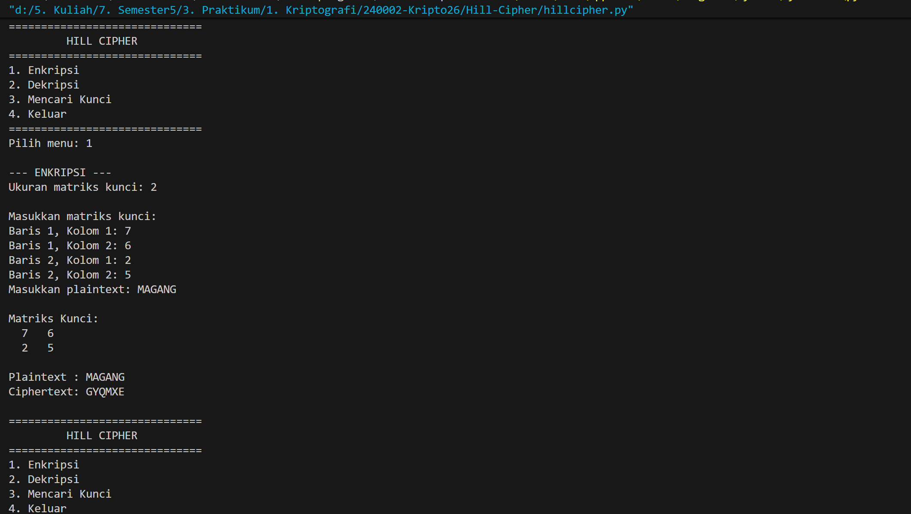
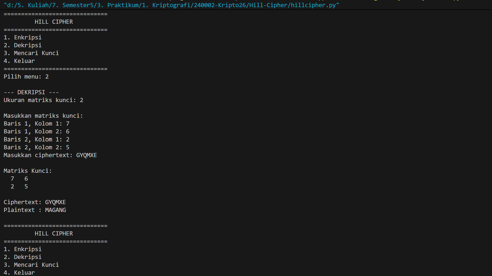
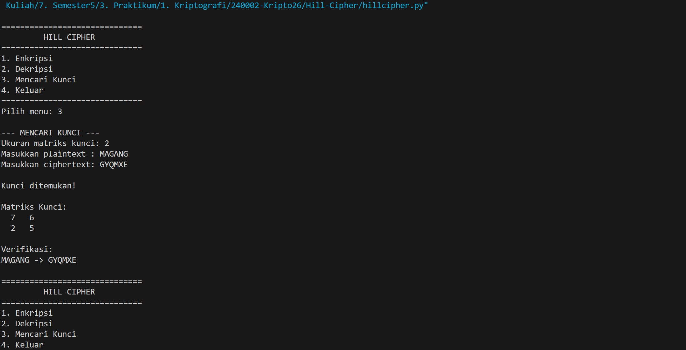

# Hill Cipher

Program sederhana untuk melakukan proses **Enkripsi, Dekripsi, dan Mencari Kunci pada Hill Cipher** menggunakan Python.

Program ini menggunakan sistem alfabet:

- A = 0
- B = 1
- C = 2
- ...
- Z = 25

Ukuran matriks kunci dapat ditentukan oleh pengguna. Jadi, program tidak menggunakan ukuran matriks yang tetap.

Contohnya:

- Jika pengguna memasukkan `2`, maka kunci berbentuk matriks `2 × 2`.
- Jika pengguna memasukkan `3`, maka kunci berbentuk matriks `3 × 3`.
- Jika pengguna memasukkan `4`, maka kunci berbentuk matriks `4 × 4`.

## Fitur

Program memiliki 4 menu utama:

1. **Enkripsi**
   - Mengubah plaintext menjadi ciphertext menggunakan matriks kunci.
   - Pengguna menentukan sendiri ukuran matriks kunci.
   - Plaintext diproses berdasarkan ukuran matriks.
   - Jika panjang plaintext tidak habis dibagi ukuran matriks, program menambahkan huruf `X` sebagai padding.
   - Proses enkripsi menggunakan modulo 26.
     

2. **Dekripsi**
   - Mengubah ciphertext menjadi plaintext.
   - Menggunakan invers dari matriks kunci.
   - Invers matriks dihitung dalam modulo 26.
   - Jika matriks kunci tidak memiliki invers modulo 26, proses dekripsi tidak dapat dilakukan.
     

3. **Mencari Kunci**
   - Mencari matriks kunci berdasarkan plaintext dan ciphertext yang diketahui.
   - Pengguna menentukan ukuran matriks kunci.
   - Program menggunakan plaintext dan ciphertext untuk membentuk matriks.
   - Matriks plaintext harus memiliki invers modulo 26 agar kunci dapat ditemukan.
     

4. **Keluar**
   - Mengakhiri program.

## Konsep Hill Cipher

Hill Cipher merupakan algoritma kriptografi yang menggunakan operasi matriks untuk melakukan proses enkripsi dan dekripsi.

Pada program ini, setiap huruf diubah menjadi angka berdasarkan alfabet:

```text
A = 0
B = 1
C = 2
...
Z = 25
```
