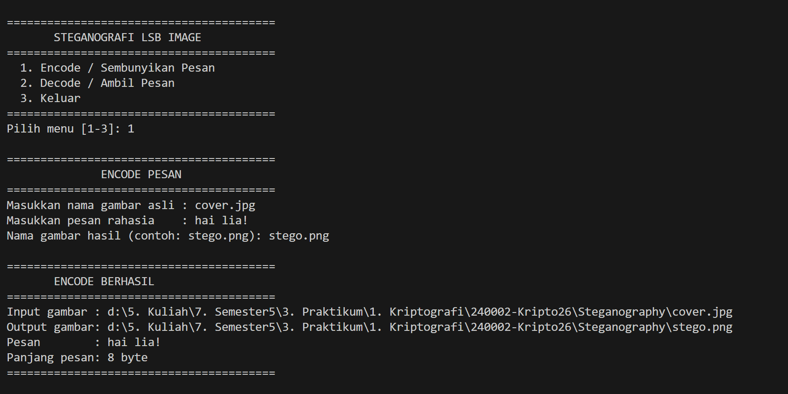
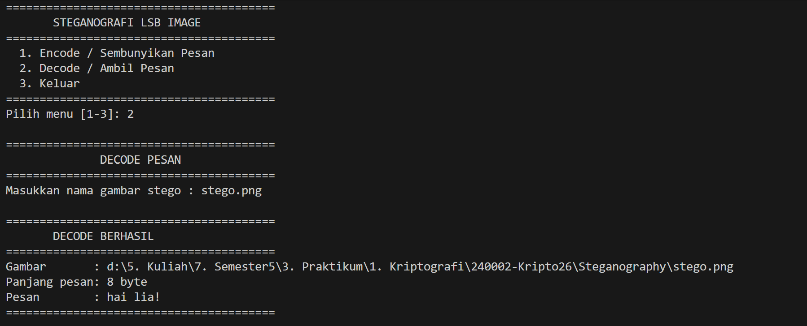

# Steganografi LSB

## Penjelasan Program

Program ini merupakan implementasi **Steganografi menggunakan metode LSB (Least Significant Bit)** menggunakan bahasa pemrograman Python.

Program dapat melakukan dua proses, yaitu:

1. **Encode / Sembunyikan Pesan**
2. **Decode / Ambil Pesan**

Program menggunakan gambar dengan format **RGB** dan menyisipkan pesan pada **bit paling rendah (LSB)** dari setiap kanal warna.

---

## Alur Program

Alur program Steganografi LSB adalah sebagai berikut:

1. Program menampilkan menu utama yang terdiri dari:
   - `1. Encode / Sembunyikan Pesan`
   - `2. Decode / Ambil Pesan`
   - `3. Keluar`

2. Program meminta pengguna memilih menu.

3. Jika pengguna memilih **menu 1 (Encode)**:
   - Pengguna memasukkan nama gambar asli.
   - Pengguna memasukkan pesan rahasia.
   - Pengguna memasukkan nama gambar hasil.
   - Pesan diubah menjadi byte menggunakan UTF-8.
   - Data pesan digabungkan dengan header `STEG` dan panjang pesan.
   - Data kemudian dikonversi menjadi bit `0` dan `1`.
   - Setiap bit pesan disisipkan pada **LSB kanal RGB** gambar.
   - Gambar hasil disimpan sebagai gambar stego.
   - Program menampilkan informasi hasil encode.

4. Jika pengguna memilih **menu 2 (Decode)**:
   - Pengguna memasukkan nama gambar stego.
   - Program mengambil bit LSB dari setiap kanal RGB.
   - Program memeriksa header `STEG`.
   - Program membaca panjang pesan.
   - Bit pesan dikonversi kembali menjadi byte.
   - Byte dikonversi kembali menjadi teks menggunakan UTF-8.
   - Program menampilkan pesan rahasia.
   - Program kembali ke menu utama.

5. Jika pengguna memilih **menu 3 (Keluar)**:
   - Program menampilkan pesan `Program selesai.`
   - Program dihentikan.

6. Jika pengguna memasukkan pilihan selain `1`, `2`, atau `3`, program menampilkan pesan:

   ```text
   [ERROR] Pilihan tidak valid!
   Silakan pilih menu 1, 2, atau 3.
   ```

   Setelah itu program kembali menampilkan menu utama.

---

## Metode LSB

Pada proses **Encode**, pesan disisipkan menggunakan metode **Least Significant Bit (LSB)**.

Contoh:

```text
Nilai RGB sebelum:
100 = 01100100

Bit pesan:
1

Nilai RGB setelah:
101 = 01100101
```

Bit terakhir dari nilai RGB diganti dengan bit pesan. Perubahan nilai piksel sangat kecil sehingga gambar secara visual tetap terlihat hampir sama.

Pada proses **Decode**, program mengambil kembali bit terakhir dari setiap kanal RGB untuk mendapatkan bit pesan yang sebelumnya disisipkan.

---

# Screenshoot Running Program

## Encode



## Decode


