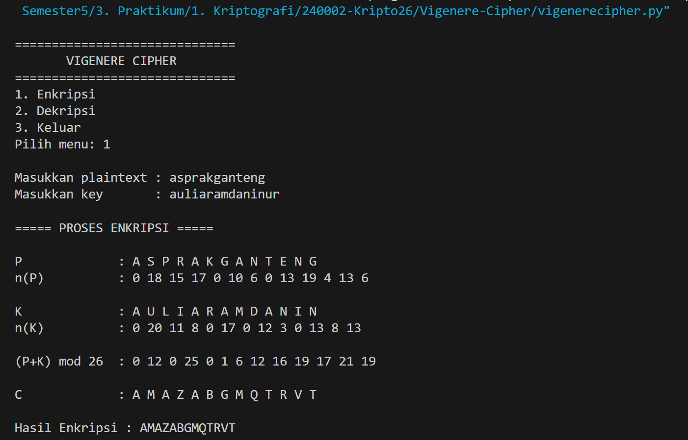
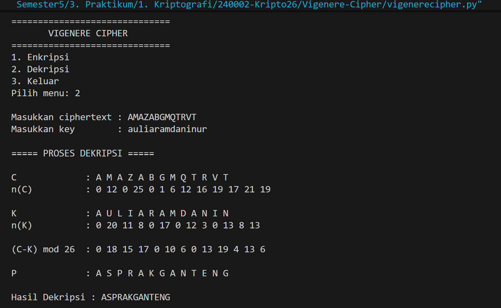

# Vigenere Cipher

## Penjelasan Program

Program ini merupakan implementasi **Vigenere Cipher** menggunakan bahasa pemrograman Python.

Program dapat melakukan dua proses, yaitu:

1. **Enkripsi**
2. **Dekripsi**

Program menggunakan aturan konversi alfabet:

```text
A = 0
B = 1
C = 2
D = 3
...
Z = 25
```

Program menggunakan **key yang diulang** apabila panjang key lebih pendek daripada plaintext atau ciphertext.

---

## Alur Program

Alur program Vigenere Cipher adalah sebagai berikut:

1. Program menampilkan menu utama yang terdiri dari:
   - `1. Enkripsi`
   - `2. Dekripsi`
   - `3. Keluar`

2. Program meminta pengguna memilih menu.

3. Jika pengguna memilih **menu 1 (Enkripsi)**:
   - Pengguna memasukkan plaintext.
   - Pengguna memasukkan key.
   - Setiap huruf plaintext dikonversi menjadi nilai angka berdasarkan aturan `A = 0` sampai `Z = 25`.
   - Setiap huruf key juga dikonversi menjadi nilai angka.
   - Key akan digunakan secara berulang sesuai panjang plaintext.
   - Proses enkripsi menggunakan rumus:

   ```text
   C = (P + K) mod 26
   ```

   Keterangan:
   - `P` = nilai plaintext
   - `K` = nilai key
   - `C` = nilai ciphertext

   - Program menampilkan:
     - `P` = huruf plaintext
     - `n(P)` = nilai angka plaintext
     - `K` = huruf key
     - `n(K)` = nilai angka key
     - `(P+K) mod 26` = hasil perhitungan
     - `C` = ciphertext

   - Setelah proses selesai, hasil enkripsi ditampilkan.
   - Program kembali ke menu utama.

4. Jika pengguna memilih **menu 2 (Dekripsi)**:
   - Pengguna memasukkan ciphertext.
   - Pengguna memasukkan key.
   - Setiap huruf ciphertext dikonversi menjadi nilai angka.
   - Setiap huruf key dikonversi menjadi nilai angka.
   - Proses dekripsi menggunakan rumus:

   ```text
   P = (C - K) mod 26
   ```

   Keterangan:
   - `C` = nilai ciphertext
   - `K` = nilai key
   - `P` = nilai plaintext

   - Program menampilkan:
     - `C` = huruf ciphertext
     - `n(C)` = nilai angka ciphertext
     - `K` = huruf key
     - `n(K)` = nilai angka key
     - `(C-K) mod 26` = hasil perhitungan
     - `P` = plaintext

   - Setelah proses selesai, hasil dekripsi ditampilkan.
   - Program kembali ke menu utama.

5. Jika pengguna memilih **menu 3 (Keluar)**:
   - Program menampilkan pesan `Program selesai.`
   - Perulangan menu dihentikan.

6. Jika pengguna memasukkan pilihan selain `1`, `2`, atau `3`, program menampilkan pesan:

   ```text
   Pilihan tidak tersedia.
   ```

   Setelah itu program kembali menampilkan menu utama.

# Screenshoot Running Program

## Enkripsi



## Dekripsi


